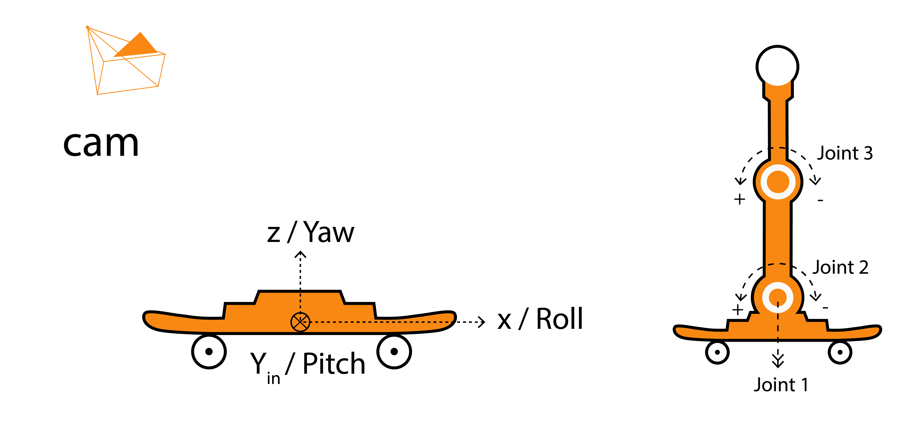
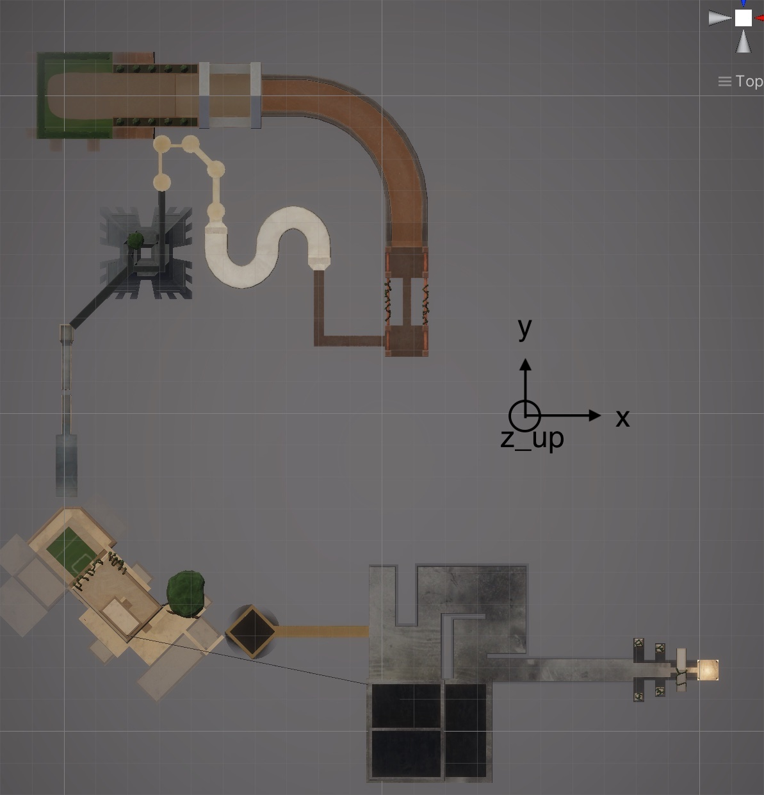

## RoboSkate action values
|variable |description |range |unit |comment |
|--- | --- | ---|  ---| ---|
|joint1 | applied force | [-40, 40]|  | |
|joint2 | applied force | [-40, 40]|  | |
|joint3 | applied force | [-40, 40]|  | |

Larger values are not returned by the velocity sensors. Due to the mass inertia, however, it is possible to work with significantly larger values for a short time without any problems.

## RoboSkate observation values

|variable |description |range |unit |comment |
|--- | --- | ---|  ---| ---|
|boardCraneJointAngles[0]|Joint1 pos|[-180, 180]|deg ||
|boardCraneJointAngles[1]|Joint2 pos| [-90, 90] | deg| |
|boardCraneJointAngles[2]|Joint3 pos| [-125, 125] | deg| |
|boardCraneJointAngles[3]|Joint1 velocity| [-170, 170] | deg/sec |input * 3,67 = output|
|boardCraneJointAngles[4]|Joint2 velocity| [-170, 170] | deg/sec |input * 3,67 = output|
|boardCraneJointAngles[5]|Joint3 velocity| [-170, 170] | deg/sec |input * 3,67 = output|

|variable |description |range |unit |comment |
|--- | --- | ---|  ---| ---|
|boardPosition [0]| x | [<-240, >240] | m | forward / backward - 500 is enough for now|
|boardPosition [1]| z | [<-20, >20] | m | up / down - 500 is enough for now|
|boardPosition [2]| y | [<-240, >240] | m | left / right - 500 is enough for now|
|boardPosition [3]| Velocity x | [-10, +10] | m/sec |10 is enough|
|boardPosition [4]| Velocity z | [-10, +10] | m/sec |10 is enough|
|boardPosition [5]| Velocity y | [-10, +10]  | m/sec |10 is enough|
|boardPosition [6]| Acceleration x | [-10, +10] | rad/sec |Very unstable better not to use.|
|boardPosition [7]| Acceleration z | [-10, +10] | rad/sec |Very unstable better not to use.|
|boardPosition [8]| Acceleration y | [-10, +10] | rad/sec |Very unstable better not to use.|

|variable |description |range |unit |comment |
|--- | --- | ---|  ---| ---|
|boardRotation [0]|  | [0, 360] | deg | not working! |
|boardRotation [1]|  | [0, 360] | deg | not working! |
|boardRotation [2]|  | [0, 360] | deg | not working! |
|boardRotation [3]| Quaternion  | [-1, 1] | not working! |
|boardRotation [4]| Quaternion  | [-1, 1] | not working! |
|boardRotation [5]| Quaternion  | [-1, 1] | not working! |
|boardRotation [6]| Quaternion  | [-1, 1] | not working! |
|boardRotation [7]| forward x | [-1, 1] |  |  If the board is pointing straight forward, this entry is 1.|
|boardRotation [8]| forward z| [-1, 1] |  | If the entry is 1, the board is vertically upright. so hopefully never|
|boardRotation [9]| forward y| [-1, 1] |  | If the board points to the left, this entry is 1. |
|boardRotation [10]| upward x | [-1, 1] |  | If the board were pitched or rolled (depending on the Yaw) 90°, this value would be 1. |
|boardRotation [11]| upward z | [-1, 1] |  | When the Bold is flat on the ground this entry is 1 (yaw dose not change this value)|
|boardRotation [12]| upward y | [-1, 1] |  | If the board were pitched or rolled (depending on the Yaw) 90°, this value would be 1. If it is rolled in initial position this is 1. |

## RoboSkate Level Map
