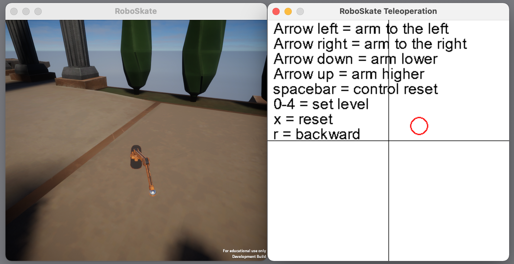

# RoboSkate scripts
- The RoboSkate environment is defined in the gym repositories.
- A Multi Input Policy has been defined in the Stable Baselines 3 repositories.
- Learning parameters are defined in the RL Baseline3 Zoo repositories.

## Image_CNN.py
The expert data with the steering angle is used to train a model that extracts a steering angle from the images.

No good results have been achieved yet.

## Image_Segmentation.py
The images with the labels on which the path is marked were used to train a variational autoencoder whose encoder then serves as image preprocessing for the RL agents.
Good results with latentspace size = 8.

## RoboSkate_collect_image_data.py
Here, image data is captured using the RoboSkate Environoment defined in the Gym repository.\
The images in the folder where the images are stored must match the image counter in the code otherwise images will be overwritten.

## VAE files

## train.py 

The terminal command below runs the training for the VAE.

python -m vae_files.train --n-epochs: number of epochs  --verbose: whether to report the training progress --z-size: The size of latent variables --learning-rate --kl-tolerance --beta: Weight for kl loss -f path-to-record/folder/

## enjoy_latent.py

The terminal command for running enjoy_latent. This code allows you to generate images using the learned latent variables.

python -m vae_files.enjoy_latent -vae logs/level-0/vae-8.pkl

## hardcoded_agent.py
Here the remote control for the agent is defined!
PyGame was used for this purpose. 
Here are also agents that play the level 1 completely automatically. For this, an optimal trajectoire is defined.

## hardcoded_agent_Test.py
This script is used to test the hardcoded agents. It starts an environment and then connects the selected agent to the environment.

## RoboSkate_BC.py
 This script is no longer up to date! 

Behavioral cloning.\
It was used to learn a policy from the expert data. This works very well.

## RoboSkate_collect_expert_data.py
 This script is no longer up to date! 

Expert data is collected both the movement with (observations and actions) as well as the images with optimal steering angle.

# How To - Behavioral cloning
0. - delete Expert data from folder `RoboSkateExpertData/directionError`.\
   - also delete images but keep the empty folder!
   

1. - start `RoboSkate_collect_expert_data.py` to get trajectory and images with ground truth direction data.
   - import the correct environoment `Env_images_and_direction_error`
   - set the number of episodes_per_file 
   - do not use multible files! The CNN dataloda can only handle 1 file yet!\
   
    
2. - Run RoboSkate_BC.py to train MLP Policy of movements
    

3. - Run Image_CNN.py to train CNN for image regression.

4. - use `hardcoded_agent_Test.py` with environment `Env_direction_error_from_CNN_images.py` to use test the hardcoded movemet with image data.
    - use `RoboSkate_BC.py` with environment `Env_joints_and_direction_error.py` without learning to test MlpPolicy.
   - use `RoboSkate_BC.py` with environment `Env_direction_error_from_CNN_images.py` without learning to test MlpPolicy and CNN Policy.
   

5. - If something does not work or you have to spend too much time in understanding parts of code please ask Finn 	
finn.sueberkrueb@tum.de

