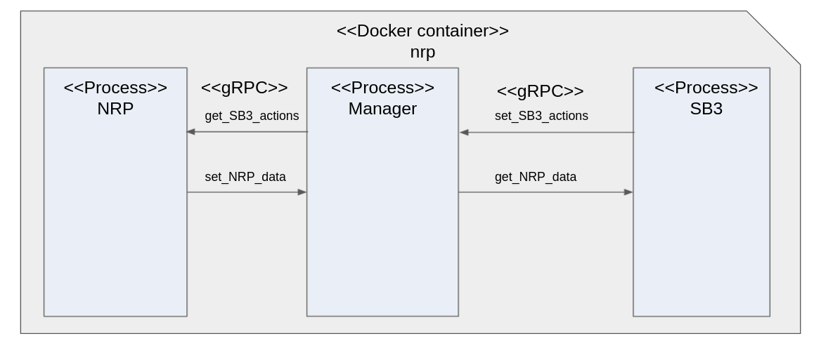

gRPC communication protocol is used to establish a communication 
channel through a system's port to enable data exchange between NRP and SB3. Because the information swap was taking place
in the NRP class loop method "runLoop" and SB3 step loop, a third class was considered, which would take a role as a server 
and handle the data distribution between subscribers e.g. NRP and SB3 (fig. \ref{fig:NRP_docker}).

With this setup it was possible to run a any trained agent with the NRP DummyBall game in a docker container, but some
drawbacks were also discovered. The first thing that could be notices was, that the agent was behaving differently then
learned and was not able to reach the end of the track. Furthermore, some synchronisation problems arised. NRP simulation 
was running faster then the agent was trained for. We assume that is why the behaviour of the agent changed. After trying 
to add timers to synchronise the loops no successful combination of timeouts was found. Because NRP is still in development,
the next version could contain solutions to the problems described above. So therefore no further explorations of the problems
were done.

Steps for running DummyBall game agent with NRP docker container.

## Step 1

Build Dockerfile:

`docker build -t nrp ./docker/NRP` 

## Step 2

Run bash scripts in sequence in different terminals:

1. Start server:

`./scripts/python_nrp/bash/dummyball_server_docker.bash`

2. Start SB3 client:

`./scripts/python_nrp/bash/dummyball_sb3_client_docker.bash`

3. Start NRP client:

`./scripts/python_nrp/bash/dummyball_nrp_client_docker.bash`

## Additional info

In order only to run cmd in the docker container:

`./scripts/python_nrp/bash/dummyball_docker.bash`

